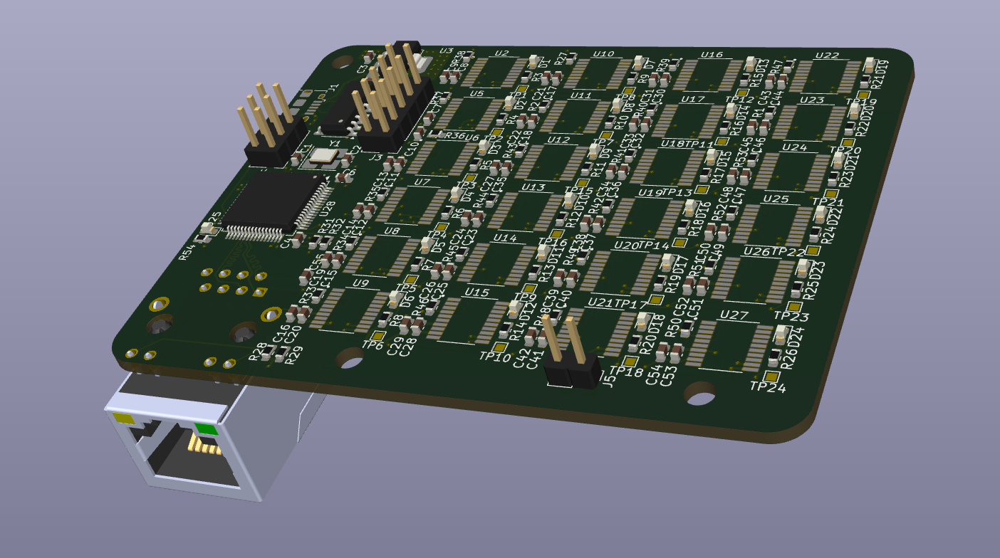
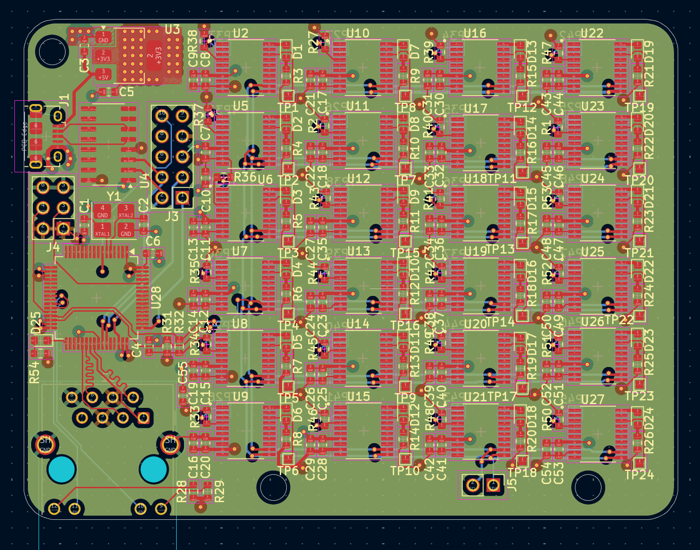
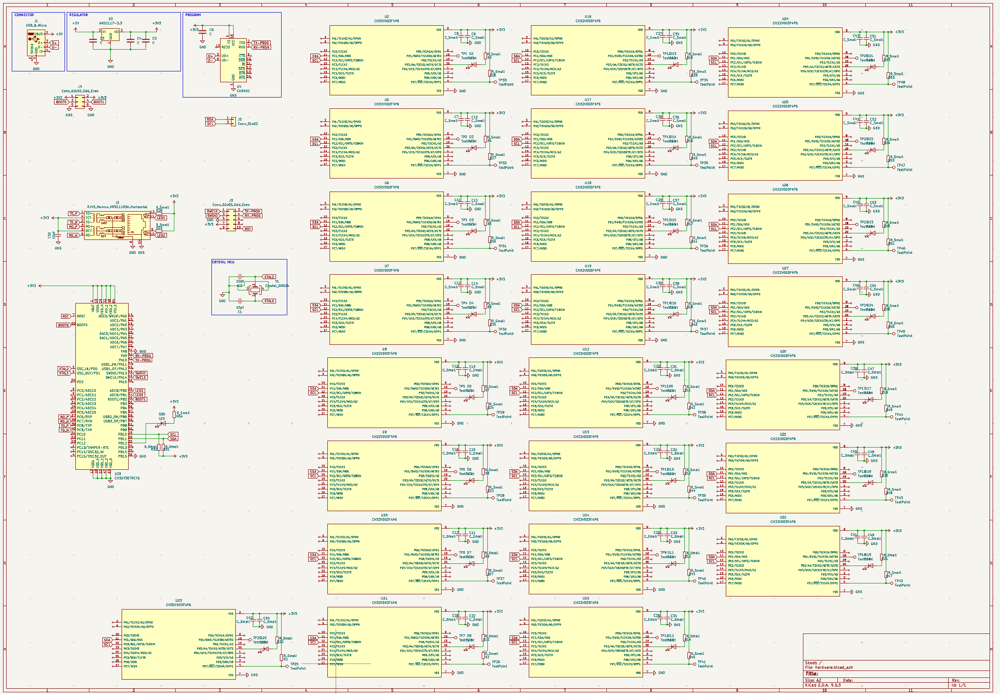

# RISC-V Cluster Project

A distributed computing cluster based on CH32V RISC-V microcontrollers with Ethernet connectivity.

[HACKADAY](https://hackaday.io/project/204036-13ghz-for-only-10-bucks)

[TINDIE](https://www.tindie.com/products/rmingon/risc-v-cluster-13ghz-combined/)


## Overview

This project implements a cluster computing system using multiple CH32V microcontrollers connected via Ethernet. The system features a master controller (CH32V307RCT6) that coordinates with multiple worker nodes (CH32V003F4P6) to form a distributed computing network.

## Project pictures





## Hardware Design

### Master Controller

- **MCU**: CH32V307RCT6 (64-pin LQFP)
- **Features**:
  - RISC-V core with Ethernet MAC
  - USB connectivity for debugging and programming
  - Ethernet port (RJ45) for network communication
  - Power regulation (3.3V via AMS1117)

### Worker Nodes

- **MCU**: CH32V003F4P6 (24 units)
- **Features**:
  - Compact RISC-V microcontrollers
  - Individual LED indicators
  - Test points for debugging
  - Distributed across the PCB

### Key Components

- **Ethernet**: RJ45 connector with integrated magnetics
- **USB**: Micro-B connector for programming and debug
- **Power**: 3.3V regulation from USB input
- **Debug**: CH340C USB-to-UART bridge
- **Connectors**: Programming headers for JTAG/SWD access

## Project Structure

```
risc-cluster/
├── hardware/                 # KiCad PCB design files
│   ├── hardware.kicad_*     # Main PCB design files
│   ├── production/          # Manufacturing files
│   │   ├── bom.csv         # Bill of Materials
│   │   ├── positions.csv   # Pick and place data
│   │   └── hardware.zip    # Gerber files
│   └── hardware-backups/   # Design history backups
└── master/                  # Master controller firmware
    ├── Core/               # RISC-V core files
    ├── Debug/              # Debug utilities
    ├── Peripheral/         # CH32V30x peripheral drivers
    ├── Startup/            # Boot code
    └── User/               # Application code
```

## Bill of Materials

| Component    | Quantity | Description                        |
| ------------ | -------- | ---------------------------------- |
| CH32V307RCT6 | 1        | Master RISC-V MCU (LQFP-64)        |
| CH32V003F4P6 | 24       | Worker RISC-V MCUs (SOP-20)        |
| AMS1117-3.3  | 1        | 3.3V voltage regulator             |
| CH340C       | 1        | USB-to-UART bridge                 |
| LEDs         | 25       | Status indicators                  |
| Resistors    | 29       | Current limiting (0603)            |
| Capacitors   | 52       | Decoupling and filtering (0603)    |
| Connectors   | 5        | USB, Ethernet, programming headers |

## Development Setup

### Hardware Tools

- KiCad 7.0+ for PCB design
- Standard PCB fabrication (4-layer board)
- Pick and place assembly for SMD components

### Software Tools

- MounRiver Studio IDE (for CH32V development)
- WCH-LinkE programmer/debugger
- CH32V peripheral library

## Getting Started

1. **Hardware Assembly**: Use the production files in `hardware/production/` for PCB fabrication
2. **Master Firmware**: Build and flash the master controller code in `master/`
3. **Worker Firmware**: Develop and deploy worker node firmware for distributed tasks
4. **Network Setup**: Configure Ethernet connectivity for cluster communication

## Recent Development

Based on git history, recent work includes:

- Initial PCB layout with CH32V microcontrollers
- Ethernet connectivity implementation
- CH32V307 master controller integration
- MounRiver Studio project setup
- Production file generation

## License

This project is licensed under the CERN Open Hardware Licence Version 2 - Strongly Reciprocal (CERN-OHL-S v2).

The hardware design files are released under CERN-OHL-S v2, which ensures that any modifications or improvements to the hardware design must be shared under the same license terms.

Note: This project uses WCH (Nanjing Qinheng Microelectronics) peripheral libraries for firmware development, which are subject to their own licensing terms.

## Contributing

This is a hardware-software co-design project. Contributions welcome for:

- Firmware optimization
- Hardware design improvements
- Cluster algorithms implementation
- Documentation and examples

